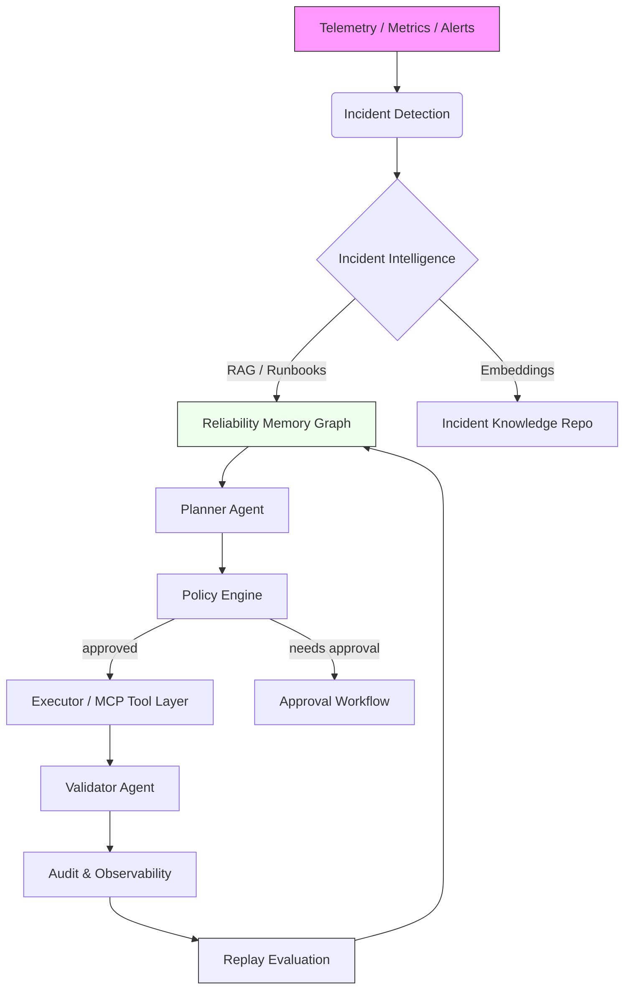
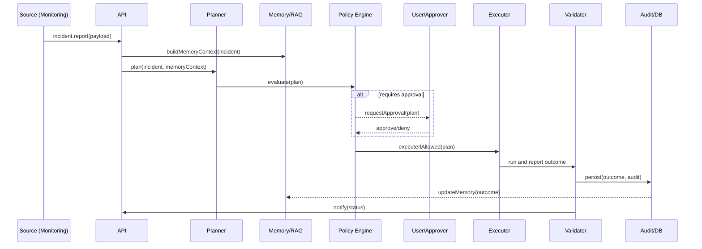
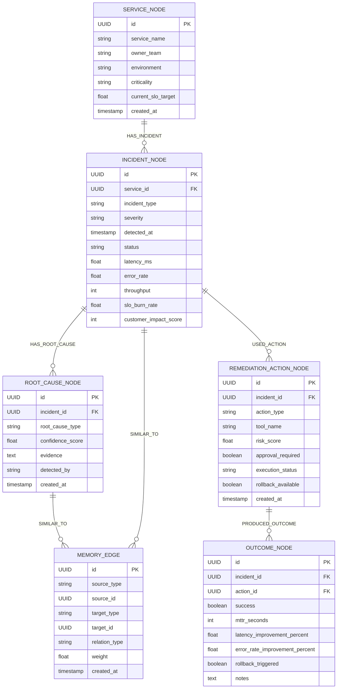

# AutoOps — Autonomous Reliability Control Plane

     

## 1. Overview
AutoOps is an autonomous reliability control plane that detects production incidents, retrieves historical incident memory, plans safe remediation, executes approved tools, validates recovery, and continuously improves via replay-based evaluation. It is engineered for production safety: policy, approval, rollback, idempotency, and observability are first-class.

## 2. Problem Statement
Modern distributed systems suffer from latency spikes, cache saturation, deployment regressions and dependency failures. Manual remediation is slow and risky; naive automation can worsen outages. Teams need a disciplined control plane that reasons about incidents, enforces safety, and learns from history.

## 3. Solution
AutoOps ingests telemetry and incidents, uses RAG + Reliability Memory Graph to provide planner context, applies a Policy Engine (RBAC, risk-scoring, approval gating), executes approved MCP-style tools via a safety layer (dry-run/rollback support), validates outcomes, and records memory for replay evaluation.

## 4. Key Features
- Planner / Executor / Validator agent pipeline
- Reliability Memory Graph (service → incident → root cause → action → outcome)
- RAG-based incident intelligence (runbooks, RCA, embeddings)
- Policy Engine, approval workflow, and Tool Execution Safety Layer
- Dry-run, idempotency keys, rollback checkpoints, audit logs
- OpenTelemetry hooks & Grafana-ready metrics
- Flyway migrations + Testcontainers integration

## 5. System Architecture
Insert architecture diagram below (Mermaid). This shows high-level data and control flow.



Short explanation:
- Incident Detection consumes telemetry and signals potential incidents.
- Incident Intelligence (RAG + memory) augments the planner with historical context and runbooks.
- Policy Engine enforces RBAC, risk scoring and decides approval requirements.
- Executor runs MCP-style tools through a safety layer; Validator confirms recovery and records outcome.
- Replay Evaluation feeds results back into the Reliability Memory Graph for continuous improvement.

## 6. Workflow
Mermaid sequence/flow that highlights decision points and validation.



Notes:
- Approval is a synchronous gate in this simplified flow; in production it may be asynchronous with callbacks.
- The memory/RAG step is used to bias the planner toward historically safe actions.

## 7. Tech Stack
Java 21, Spring Boot, Spring Data JPA, PostgreSQL, Flyway, Kafka, Redis, OpenTelemetry, Grafana, Docker, Maven, JUnit, Testcontainers. Optional: pgvector / vector DB for embeddings.

## 8. Project Modules
- api: controllers & OpenAPI
- incident-service: ingestion + detection
- planner: plan generation
- intel: RAG, embeddings, runbooks
- memory: Reliability Memory Graph and repos
- policy: Policy Engine and risk scoring
- executor: MCP tool adapters & safety layer
- validator: recovery validation
- replay: evaluation & scoring
- chaos: simulation scaffolds

## 9. API Endpoints
- POST /api/v1/incidents — create & process
- GET /api/v1/incidents — list
- GET /api/v1/incidents/{id} — details
- POST /api/v1/approvals/{id}/approve — approve

## 10. Database / Entity Relationship
Mermaid ER diagram showing main nodes and relationships.



Short explanation:
- The ER diagram models the graph-like memory using node tables and memory edges. Query patterns include: find similar incidents by root cause, find successful actions for a root cause, and compute historical risk given prior outcomes.

## 11. Safety and Reliability Design
RBAC, approval gates, dry-run, idempotency keys, rollback checkpoints, immutable audit logs; policy thresholds and mitigation suggestions are central.

## 12. How to Run Locally
Prereqs: Java 21, Maven, Docker. Quickstart:
```bash
git clone https://github.com/kunal7216/AutoOps--Autonomous-Reliability-Control-Plane.git
cd AutoOps--Autonomous-Reliability-Control-Plane
mvn clean package
mvn spring-boot:run
# or docker compose up --build
```

## 13. Testing
Unit tests (JUnit + Mockito). Integration tests use Testcontainers (Postgres).

## 14. Screenshots
Mermaid diagrams render in GitHub; add screenshots only for dashboards or UI pages when available.

## 15. Future Enhancements
pgvector/Vector DB, persistent approval UI, full replay/evaluation pipeline, Kubernetes operator, PagerDuty/Jira integration.

## 16. Resume / Interview Highlights
- Upgraded to AutoOps X v2 with Reliability Memory Graph, RAG scaffolding, policy & safety layers, and replay evaluation scaffolds.

---

*Mermaid diagrams are embedded above. They render on GitHub automatically.*
